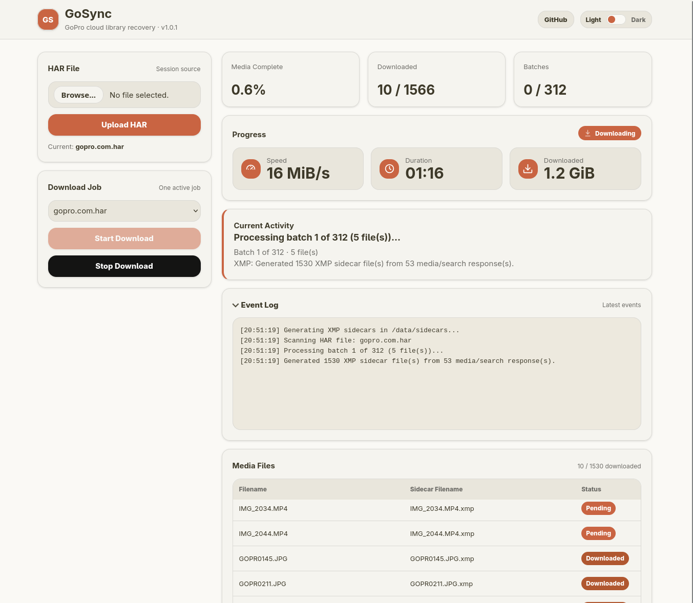

# GoSync

GoSync is a self-hosted Python and Docker utility for downloading a GoPro cloud
media library when the official bulk download flow is too limited for large
collections.

GoPro Cloud limits bulk downloads to 25 items at a time. GoSync works around
that by reading media metadata and session headers from a browser HAR export,
calling the GoPro download API directly, downloading in safe resumable batches,
and writing downloaded media plus XMP sidecars into a mounted data directory.
The web dashboard shows concise run status, grouped event history, transfer
progress, and expandable batch details with each file and size.

This project was inspired by
[josefkeup741/gopro-cloud-rescue](https://github.com/josefkeup741/gopro-cloud-rescue).

GoSync is a vibe-coded, AI-assisted utility built around a real GoPro Cloud
download need.

## Screenshot



## Requirements

- Docker or Docker Compose
- Python 3.12+ for direct local development or CLI runs
- A HAR file exported from your logged-in GoPro media library
- Enough free disk space in the mounted data directory for the downloaded media

## Quick Start

Run with Docker Compose:

```bash
docker compose up
```

Open the web UI:

```text
http://localhost:49152
```

The default [docker-compose.yml](docker-compose.yml) pulls the published image,
mounts `./data` into the container at `/data`, and exposes the web UI on host
port `49152`. Docker Compose creates the default `./data` host directory if it
does not already exist.

To use a different host directory or web port:

```bash
GOSYNC_VOLUME_PATH=/mnt/media/gosync GOSYNC_WEB_PORT=49153 docker compose up
```

Plain Docker also works:

```bash
docker run --rm \
  -p 8080:8080 \
  -v "$PWD/data:/data" \
  ghcr.io/prabhanshuattri/gosync:1.3.0
```

Then open `http://localhost:8080`.

## HAR Export

1. Log in to your GoPro media library in a browser.
2. Open Developer Tools with `F12`.
3. Go to the Network tab.
4. Refresh the page while the Network tab is recording.
5. Slowly scroll to the bottom of the GoPro media library so every item loads.
6. Export the Network log as a HAR file.
7. Save the file as `gopro.com.har`, or use a custom name and set `HAR_FILE`.

HAR files can contain sensitive session data such as cookies or authorization
headers. Keep the file private and delete it when you no longer need it.

If downloads fail with `403 Forbidden`, export a fresh HAR while logged in and
make sure the Network export includes request headers such as `Cookie` or
`Authorization`.

## Documentation

- [Project overview](docs/project-overview.md): architecture, runtime
  components, and data flow.
- [Usage guide](docs/usage.md): web UI workflow, resume behavior, data directory
  layout, and environment configuration.
- [Download items](docs/download-items.md): HAR-derived media records, download
  state, extraction, chapter files, and sidecar relationships.
- [XMP sidecar processing](docs/sidecars.md): sidecar field selection and
  sensitive field exclusions.
- [Development guide](docs/development.md): local builds, direct Python runs,
  tests, and release links.
- [Release process](docs/release.md): versioning, image publishing, and checks.
